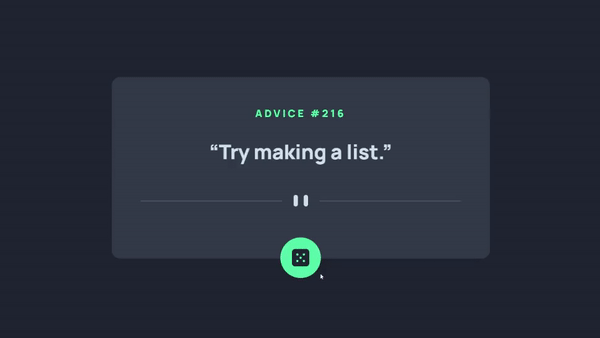

# Frontend Mentor - Advice generator app solution

This is a solution to the [Advice generator app challenge on Frontend Mentor](https://www.frontendmentor.io/challenges/advice-generator-app-QdUG-13db).

## Table of contents

- [Overview](#overview)
  - [The challenge](#the-challenge)
  - [Preview](#preview)
  - [Links](#links)
- [My process](#my-process)
  - [Built with](#built-with)
  - [What I learned](#what-i-learned)
  - [Useful resources](#useful-resources)
- [Author](#author)

## Overview

### The challenge

Users should be able to:

- View the optimal layout for the app depending on their device's screen size
- See hover states for all interactive elements on the page
- Generate a new piece of advice by clicking the dice icon

### Preview
<p align="center">
    
</p>

### Links

- Solution URL: [frontendmentor.io/solutions/advice-generator-app-BannXvzEy7](https://www.frontendmentor.io/solutions/advice-generator-app-BannXvzEy7)
- Live Site URL: [acyein.github.io/advice-generator-app](https://acyein.github.io/advice-generator-app/)

## My process

### Built with

- HTML
- Tailwind CSS
- JavaScript

### What I learned
Figuring out how to show / hide loading spinner before / after data is fetched from API.
```js
function getAdvice() {
    // before fetching: show loader, hide quote el, disable btn
    loader.style.display = 'block';
    quoteEl.style.display = 'none';
    btn.disabled = true;

    fetch(url)
        .then(response => {
            return response.json();
        })
        .then(data => {
            // take id & advice from json
            let id = data.slip.id;
            let advice = data.slip.advice;
            
            // once fetched: hide loader, show quote el, make btn clickable
            loader.style.display = 'none';
            quoteEl.style.display = 'block';
            btn.disabled = false;

            // set id & advice into elements
            adviceId.innerHTML = id;
            quoteEl.innerHTML = advice;
        })
        .catch(function(error) {
            console.log(error);
        });
}
```

### Useful resources

- [Pure CSS Loaders](https://loading.io/css/) - Spinning loaders made only with CSS.

## Author

- Website - [Chian Yein](https://acyein.netlify.app/)
- Frontend Mentor - [@acyein](https://www.frontendmentor.io/profile/acyein)